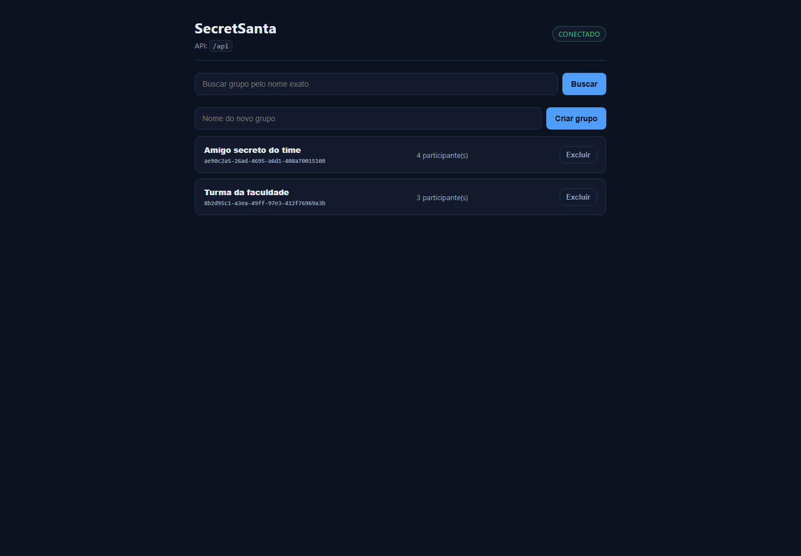
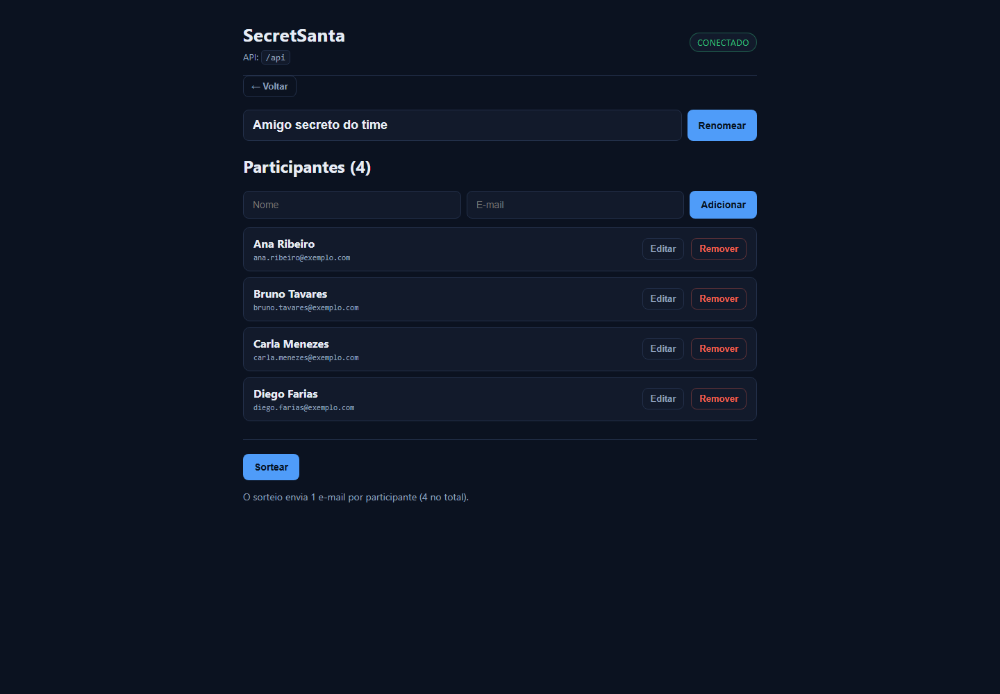
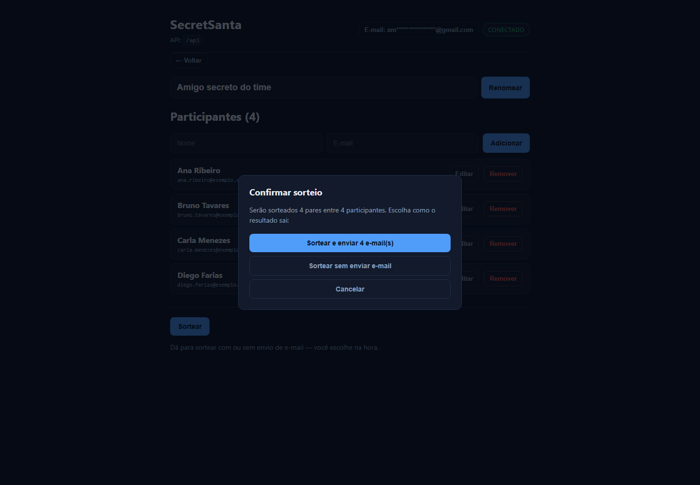
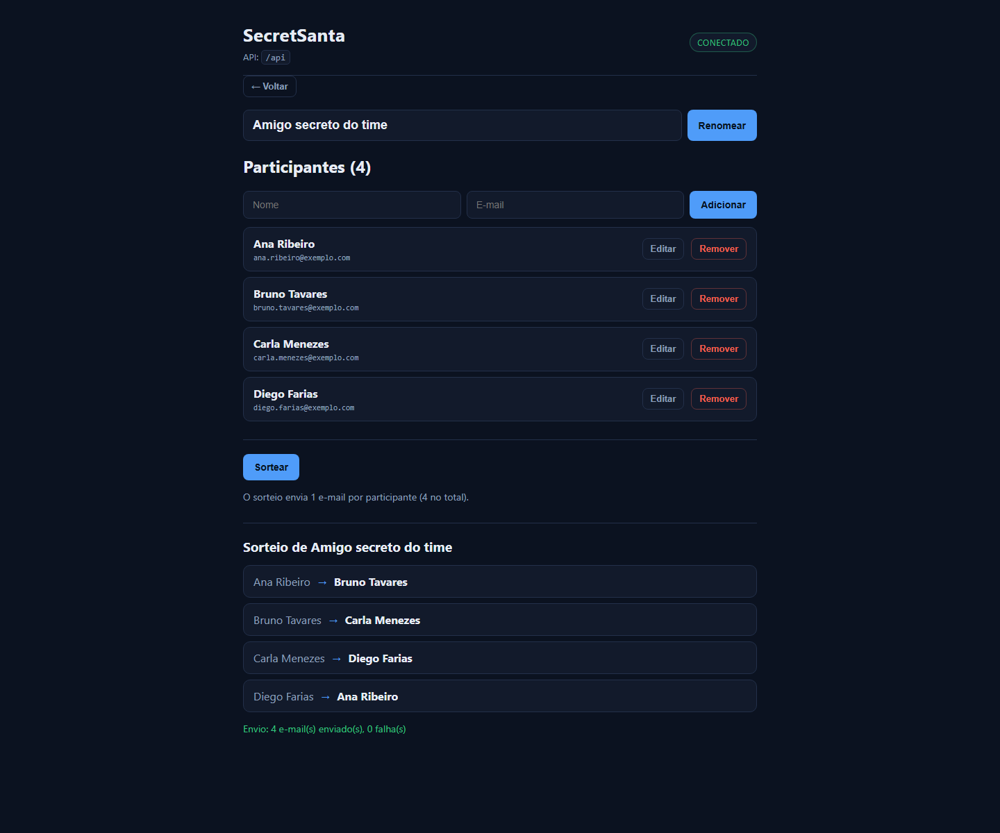

# Amigo Secreto — API


> API REST para organizar sorteios de amigo secreto: cadastra o grupo, realiza o sorteio e envia o resultado por e-mail para cada participante.

## 📸 Telas

| Lista de grupos | Grupo e participantes |
|---|---|
|  |  |

| Confirmação antes de sortear | Resultado do sorteio |
|---|---|
|  |  |

As imagens são geradas com dados fictícios, em banco descartável e com o envio de e-mail desligado
(`MAILER_TRANSPORT=json`) — produzir o material não dispara e-mail para ninguém.

## 🎯 O problema

Organizar amigo secreto em grupo pequeno sempre esbarra nas mesmas tarefas manuais: juntar os nomes, sortear sem que alguém tire a si mesmo, avisar cada pessoa do seu par e manter em sigilo quem tirou quem. Feito à mão, é fácil errar ou vazar o resultado.

## 💡 A solução

A API centraliza o processo:

- Cadastro do evento (o "amigo secreto") com o nome do grupo
- Cadastro dos **participantes** de cada evento
- **Sorteio** dos pares em rotação, garantindo que ninguém tire a si próprio
- **Envio do resultado por e-mail** para cada participante, individualmente
- Persistência do resultado do sorteio para consulta posterior

## 🏗️ Arquitetura

```
[Cliente HTTP]
      ↓
[routes] → [controllers] → [services] → [repositories] → [models / MongoDB]
                                ↓
                        [nodemailer / Gmail]
```

**Decisões técnicas:**

| Decisão | Escolha | Por quê |
|---|---|---|
| Banco | MongoDB com Mongoose | o modelo é de documento aninhado: um evento contém uma lista de participantes |
| Organização | camadas (rotas, controllers, services, repositórios, models) | separa entrada HTTP, regra de negócio e acesso a dados |
| E-mail | Nodemailer com Gmail | avisar cada participante individualmente era requisito do projeto |
| Ambiente | Docker Compose | sobe a API e o banco juntos, sem instalar MongoDB na máquina |
| Autenticação | sem autenticação | projeto de portfólio, não distribuído: a API só é alcançável de dentro da máquina (container publicado no host via proxy do nginx). Cadastro e login não agregam no escopo |

## 🔌 Endpoints

**Eventos (`/secret-santa`)**

| Método | Rota | Ação |
|---|---|---|
| GET | `/secret-santa` | lista os eventos (aceita filtros por query) |
| GET | `/secret-santa/:id` | busca um evento pelo ID |
| POST | `/secret-santa` | cria um evento |
| PATCH | `/secret-santa/:id` | atualiza um evento |
| DELETE | `/secret-santa/:id` | remove um evento |

**Participantes (`/secret-santa/:id/users`)**

| Método | Rota | Ação |
|---|---|---|
| GET | `/secret-santa/:id/users` | lista os participantes do evento |
| GET | `/secret-santa/:id/users/:userId` | busca um participante |
| POST | `/secret-santa/:id/users` | adiciona participante |
| PATCH | `/secret-santa/:id/users/:userId` | atualiza participante |
| DELETE | `/secret-santa/:id/users/:userId` | remove participante |
| GET | `/secret-santa/:id/sortUsers` | realiza o sorteio e dispara os e-mails |

Os IDs são validados como UUID e o corpo das requisições passa por validação antes de chegar ao serviço.

## ▶️ Como rodar

**Com Docker (recomendado):**

```bash
cp .sample.env .env      # preencha as variáveis
npm run db:up           # MongoDB em container (volume nomeado)
npm start                # API em http://localhost:3000
```

Ou tudo dentro do Docker: `docker compose up`.

**Localmente:**

```bash
npm install
cp .sample.env .env
npm start                # http://localhost:3000
```

## 🖥️ Front end (web app)

SPA em **React + Vite**, servida por um nginx que também faz proxy de `/api` para o
container da API (sem CORS e sem expor a API direto).

O front faz: listar / criar / renomear / excluir grupo, adicionar / editar / remover participante
e **sortear** — com confirmação explícita antes de disparar os e-mails (o sorteio manda e-mail de
verdade) e o relatório de envio (enviados / falhas) na tela.

Testes de UI:

```bash
cd web && npm test     # Vitest + Testing Library, com fetch mockado: sem API e sem e-mail real
```

```bash
npm run db:up          # ou: docker compose up -d --build
npm run web:up         # build + sobe o front em http://localhost:8090
```

Abra **http://localhost:8090**.

> Em `localhost` o navegador considera o site um contexto seguro, então o PWA é instalável sem HTTPS.

**Rodando o front em modo dev** (hot reload, com a API no Docker):

```bash
cd web
npm install
VITE_DEV_API_TARGET=http://localhost:3000 npm run dev    # http://localhost:5173
```

### Configuração da API

O front sempre chama `/api/...`. O destino é o único ponto de configuração:

| Cenário | Como apontar |
|---|---|
| Tudo em Docker (padrão) | nada a fazer — o nginx proxeia para `api:3000` |
| API remota | `VITE_API_BASE_URL=https://sua-api` no build |
| Backend embutido num `.exe` | mesmo `VITE_API_BASE_URL` apontando para o servidor local do app |

## 🚀 Executável de lançamento (Windows)

Em `launcher/` há um app em **Go** que faz o encanamento: confere o Docker (e sobe o
Docker Desktop se estiver parado), baixa/atualiza o projeto, sobe os containers e abre a
janela do app em modo aplicativo. Tudo continua rodando em container — o executável não é o app.

```bash
cd launcher
go build -o SecretSanta.exe .     # ~8 MB, sem dependências externas
```

| Opção | Para que serve |
|---|---|
| *(nenhuma)* | sobe tudo e abre a janela |
| `--sem-janela` | sobe sem abrir o navegador |
| `--abrir` | apenas abre a janela |
| `--parar` | derruba a stack (os dados ficam no volume) |
| `--recriar` | refaz o build das imagens |
| `--atualizar` | baixa a versão mais recente do projeto antes de subir (e recria os containers) |
| `--dir <pasta>` | usa outra pasta de projeto |
| `--porta <n>` | porta do front (padrão 8090) |

- **Primeira execução**: baixa o projeto para `%LOCALAPPDATA%\SecretSantapp` e builda as imagens.
- **Atualizar**: `--atualizar` rebaixa o projeto e recria os containers. Ele só apaga a pasta se
  ela tiver sido criada pelo próprio lançador (marcador `.secretsanta-lancador`); apontada para uma
  pasta sua com `--dir`, ele extrai por cima sem remover nada.
- **Credenciais**: um `.env` em `%APPDATA%\SecretSanta\.env` é copiado para lá automaticamente,
  então o segredo fica fora do código. Sem esse arquivo, ele usa o `.sample.env` e avisa que falta configurar.
- **Mesmo banco do desenvolvimento**: o launcher usa `-p secretsanta`, o mesmo projeto Compose
  do `docker compose up`, então compartilha o volume — os grupos cadastrados não somem.
- **Requisitos**: Docker Desktop (o launcher abre a página de download se não achar) e Edge ou
  Chrome para a janela em modo aplicativo.

## 📱 PWA (instalável)

O front é um PWA completo: `manifest.webmanifest` com ícones 192/512 (e um `maskable`),
`service worker` com handler de fetch. No Edge ou Chrome aparece a opção de instalar — janela
própria, ícone no menu Iniciar, sem barra de navegador.

Os ícones são gerados por script (encoder PNG próprio, só biblioteca padrão do Python):

```bash
python web/scripts/gerar-icones.py     # regrava web/public/icon-*.png
```

Regra do service worker: **nada da API vem do cache**. `/api/...` sempre vai à rede; o HTML é
network-first (HTML velho apontando para assets novos quebraria o app após um deploy) e só os
assets com hash no nome são servidos do cache.

## ✅ Integração contínua

`.github/workflows/ci.yml` roda a cada push e pull request, em três frentes:

| Job | O que verifica |
|---|---|
| **API** | `npm ci` + a suíte Jest/Supertest sobre MongoDB em memória |
| **Front** | `npm ci` + Vitest, e confere que o build de produção passa |
| **Lançador** | `go vet` e o build do `.exe` (publicado como artefato `SecretSanta-windows`) |

## 🗄️ Banco de dados: com volume e sem volume

| Modo | Como subir | O que acontece com os dados |
|---|---|---|
| **Persistente** (padrão) | `npm run db:up` | ficam num volume nomeado do Docker (`mongo-data`); sobrevivem a `npm run db:down`, restart e reboot |
| **Descartável** | `npm run db:up:ephemeral` | vivem em memória (`tmpfs`); ao derrubar com `npm run db:down:ephemeral`, o banco zera sozinho |

Os dois modos publicam a mesma porta (27017), então rode um por vez. O modo descartável usa
um projeto Compose próprio (`secretsanta-ephemeral`) e não encosta no volume do modo persistente.

**Zerar o banco sem derrubar nada:**

```bash
npm run db:reset     # dropDatabase() no container que está no ar
npm run db:destroy   # apaga o volume do modo persistente (docker compose down -v)
```

O banco **não** fica dentro da pasta do repositório: o volume é gerenciado pelo Docker.

## ⚙️ Variáveis de ambiente

| Variável | Para que serve |
|---|---|
| `DB_HOST` | host do MongoDB |
| `DB_PORT` | porta do MongoDB |
| `DB_NAME` | nome do banco |
| `MAILER_EMAIL` | conta Gmail usada no envio |
| `MAILER_PASS` | senha de aplicativo dessa conta Gmail |
| `MAILER_TRANSPORT` | transporte de e-mail: `gmail` (padrão) ou `json` (não envia, usado nos testes) |

O arquivo `.env` **não** é versionado — use o `.sample.env` como modelo e nunca comite credenciais.

## 📧 Mensageria: como configurar o envio de e-mail

O sorteio avisa cada participante por e-mail, e o envio é feito por uma conta **Gmail** usando uma **senha de app**. As duas variáveis precisam estar preenchidas no `.env`, com **exatamente estes nomes**:

```env
MAILER_EMAIL=seu.email@gmail.com
MAILER_PASS=abcdefghijklmnop
```

> ⚠️ `MAILER_EMAIL` não é a senha da conta. É uma **senha de app**, gerada à parte, com 16 caracteres. A senha normal do Gmail **não funciona** aqui e não deve ser usada.

### Passo a passo para gerar a senha de app

1. **Crie uma conta Gmail para o projeto.** Não use sua conta pessoal — essa credencial fica no arquivo de ambiente de quem roda o projeto.
2. **Ative a verificação em duas etapas** em [`myaccount.google.com/security`](https://myaccount.google.com/security). Esse passo é obrigatório: **o Google só libera senha de app para contas com verificação em duas etapas ativa**.
3. Acesse [`myaccount.google.com/apppasswords`](https://myaccount.google.com/apppasswords).
4. Dê um nome para a senha (ex.: `amigo-secreto`) e clique em **Criar**.
5. O Google mostra **16 caracteres** — copie na hora, porque **ele não mostra de novo**.
6. Cole em `MAILER_PASS` no seu `.env`, **sem espaços**.
7. Reinicie a aplicação. Se as variáveis estiverem ausentes ou erradas, a aplicação **avisa no console na subida** — o sorteio não vai enviar nada em silêncio.

### Se os e-mails não estiverem saindo

- Confira se os **dois** nomes estão exatamente iguais aos do exemplo acima
- Confirme que a **verificação em duas etapas** está ativa na conta
- Verifique se o Google não **revogou** a senha de app (acontece ao trocar a senha da conta)
- Lembre que contas novas do Gmail podem ter limite diário de envio reduzido

## 📂 Estrutura

```
app.js                 # sobe o Express, liga rotas e tratamento de erro
routes/                # definição das rotas
controllers/           # entrada HTTP e resposta
services/              # regra de negócio (inclui o sorteio e o envio de e-mail)
repositories/          # acesso ao banco
models/                # schemas do Mongoose
middlewares/           # validação de payload e tratamento de erros
constants/             # mensagens e constantes
db/connection.js       # conexão com o MongoDB
Dockerfile / docker-compose.yml
```

## 🧪 Testes

Suíte de integração com **Jest + Supertest**, rodando contra um MongoDB em memória
(`mongodb-memory-server`) — não precisa de banco instalado nem do Docker:

```bash
npm test
```

O que está coberto: criação, renome, busca e remoção de eventos; CRUD de participantes;
validações de payload e de UUID; sorteio (ninguém tira a si mesmo, cada um dá e recebe
exatamente um presente, par persistido no banco); e o relatório de envio de e-mail.

Os testes rodam com `MAILER_TRANSPORT=json` — nenhum e-mail real é disparado.

## 🗺️ Roadmap

- [x] Testes de integração dos endpoints e do sorteio
- [x] Pipeline de integração contínua
- [x] Front end instalável (PWA) com CRUD completo e tela de sorteio
- [x] Executável de lançamento para Windows
- [x] MongoDB em volume nomeado, modo descartável e scripts de reset
- [ ] Autenticação nas rotas — **fora de escopo por decisão**: é peça de portfólio, não um produto distribuído, e a API só é alcançável localmente

## 👥 Autores

Projeto desenvolvido em grupo por:

- Wagner Souza
- Deyvison Ramos
- Davi Nunes
- Raphael Machado

## 📄 Licença

ISC — o texto está em [LICENSE](LICENSE). O histórico de mudanças está em [CHANGELOG.md](CHANGELOG.md).
